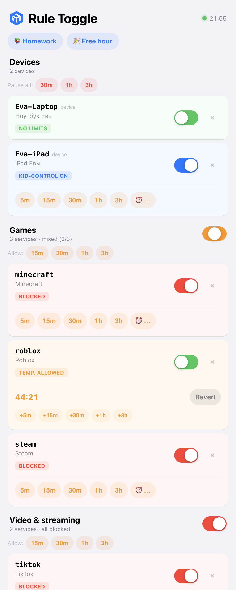
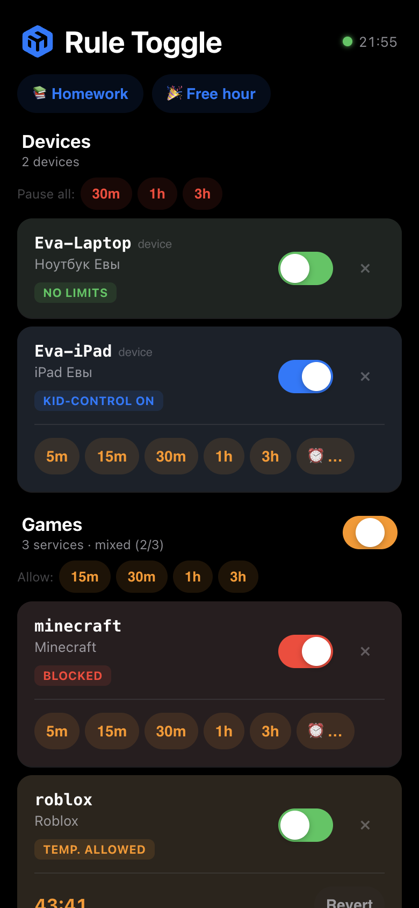
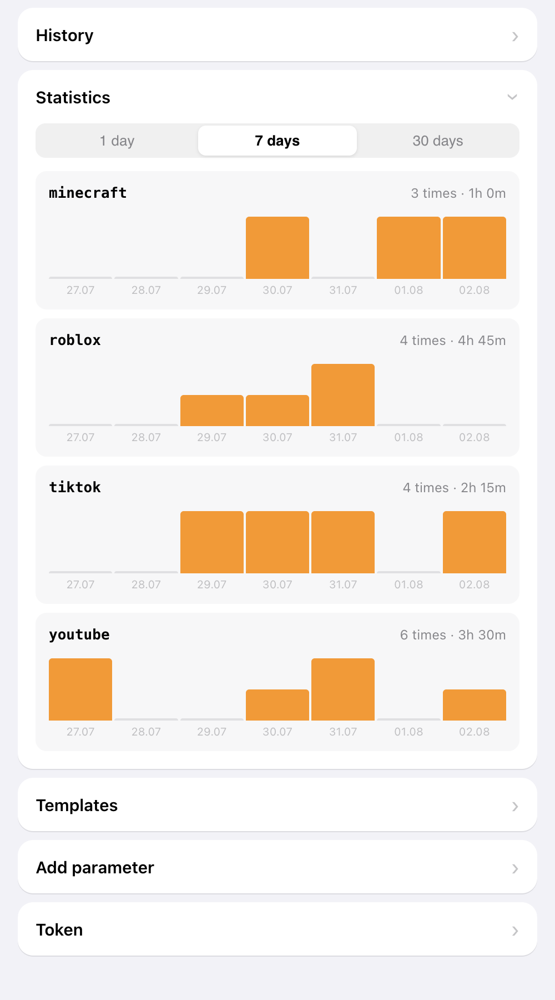

# MikroTik Rule Toggle

Удалённое управление правилами MikroTik через веб-панель. Включайте и выключайте firewall-правила и kid-control с телефона.

## Скриншоты

<p align="center">
  
  &nbsp;&nbsp;
  
</p>

Основной экран — переключатели правил, таймер с обратным отсчётом, кнопки продления, статус роутера. Поддерживается светлая и тёмная тема.

<p align="center">
  
</p>

Аналитика — графики использования таймеров за 1/7/30 дней.

## Как это работает

1. **Веб-панель** (Go, Docker) — toggle-переключатели, таймеры временной разблокировки, аудит-лог
2. **Скрипт RouterOS 7** — по таймеру читает состояние с сервера и включает/выключает правила по тегам `hook:<name>`

```
[Web UI / PWA] → [Go Backend + Bearer Auth] ← [MikroTik скрипт по таймеру]
                          ↕
                   state.json + audit.json
```

Параметр имеет тип (`kind`): **`device`** — kid-control-запись (тег в `name`, инвертированная логика), **`service`** — firewall/DNS-блок (тег в `comment`). Сервисы можно объединять в группы (`group`) — UI показывает их секциями с мастер-тогглом. Группировка живёт целиком на сервере: роутер получает плоский `params` и о группах не знает. Старый `state.json` (только `inverted`) мигрирует автоматически при первом старте.

## Возможности

- **Toggle** — включение/выключение firewall-правил и kid-control
- **Разделы** — параметры двух типов: **устройства** (kid-control) и **сервисы** (firewall/DNS-блоки); UI рендерит их отдельными секциями
- **Группы сервисов** — игры / видео и стриминг / соцсети (+ свои через UI); мастер-тоггл и таймер на всю группу одним действием
- **Пауза для всех устройств** — одна кнопка временно ограничивает все устройства (kid-control), с таймером и кнопкой «Возобновить»
- **Пресеты-режимы** — «Уроки» (заблокировать все группы) и «Свободный час» (разблокировать всё на час); свои пресеты — правкой `state.json`
- **Шаблоны сервисов** — готовые заготовки блокировок (YouTube, TikTok, Twitch, Netflix, Kick, Steam, Roblox, Minecraft, Fortnite, Twitter/X, Facebook, Instagram, Snapchat, Discord, VK): кнопка в приложении создаёт параметры по группам, сгенерированный `templates.rsc` создаёт правила в фаерволе роутера
- **Таймеры** — временная разблокировка на 5м, 15м, 30м, 1ч, 3ч, 6ч или «до HH:MM» (нативный time-picker, локальная TZ браузера) с обратным отсчётом
- **Продление таймеров** — кнопки +5м/+15м/+30м/+1ч/+3ч и для активного, и для pending-таймера
- **Pending-таймеры** — отсчёт начинается только когда роутер забирает настройки
- **Kid-control** — инвертированная логика (включён = ребёнок ограничен)
- **Conntrack clearing** — при включении блокировки сбрасываются существующие соединения по src/dst-address-list
- **Temp-block** — временная полная блокировка устройства (30 сек) при включении правила, убивает game sessions даже если game server IP не в address-list
- **Автообновление скрипта** — роутер автоматически обновляет скрипт при появлении новой версии на сервере
- **Аудит-лог** — история всех действий (toggle, таймеры, expired), до 2000 записей
- **Аналитика** — графики использования таймеров за 1/7/30 дней с разбивкой по суткам
- **Статус роутера** — heartbeat (онлайн/офлайн) с точным временем последнего обращения
- **Версионирование скрипта** — предупреждение в UI если скрипт на роутере устарел
- **PWA** — устанавливается на телефон как приложение
- **Pull-to-refresh** — свайп вниз для обновления
- **CI/CD** — GitHub Actions собирает Docker-образ и пушит в ghcr.io

## Запуск сервера

```bash
# Самый простой способ — pull готового образа и запуск
make up

# С явным указанием IP и токена
HOST_IP=10.0.0.5 AUTH_TOKEN=secret docker compose up -d

# Через .env файл
echo "HOST_IP=10.0.0.5" > .env
echo "AUTH_TOKEN=secret" >> .env
docker compose up -d

# Локальная сборка (без CI)
make build-local

# Без Docker
go build -o hook-server ./server/
AUTH_TOKEN=secret ./hook-server
```

`HOST_IP` автоматически подставляется в скрипт `remote-hook.rsc` при старте контейнера — MikroTik скачает скрипт с уже правильным адресом сервера.

Веб-панель доступна на `http://<HOST_IP>:8080`.

### Make-команды

| Команда | Описание |
|---------|----------|
| `make up` | Запуск (образ из ghcr.io, IP определяется автоматически) |
| `make down` | Остановка |
| `make logs` | Просмотр логов |
| `make pull` | Подтянуть новый образ из ghcr.io |
| `make restart` | Pull + пересоздание контейнера (обновление на сервере) |
| `make build-local` | Локальная сборка и запуск |

### Обновление на сервере

После пуша в master GitHub Actions автоматически соберёт образ. На сервере:

```bash
make restart
```

### Переменные окружения

| Переменная   | Default   | Описание                           |
|-------------|-----------|-------------------------------------|
| `LISTEN_ADDR` | `:8080`  | Адрес и порт для прослушивания     |
| `DATA_DIR`    | `./data` | Директория для хранения состояния   |
| `AUTH_TOKEN`  | —        | Bearer token для защиты API         |

## Настройка MikroTik

### 1. Пометьте правила тегами

Для **firewall** — в поле `comment`, для **kid-control** — в поле `name`:

```
/ip/firewall/filter add chain=forward action=drop dst-address-list=roblox comment="hook:roblox-drop" disabled=yes
/ip/kid-control add name="hook:Eva-Laptop" fri=6h-20h mon=6h-19h ...
```

### 2. Скачайте и установите скрипт

Скрипт доступен для скачивания прямо с сервера (авторизация не требуется):

```
# Скачайте скрипт с сервера на роутер
/tool/fetch url="http://your-server:8080/mikrotik/remote-hook.rsc" dst-path=remote-hook.rsc

# Отредактируйте url и token в начале скрипта, затем создайте скрипт
/system/script add name=remote-hook source=[/file/get remote-hook.rsc contents]

# Создайте расписание (каждую минуту)
/system/scheduler add name=remote-hook interval=1m on-event="/system/script/run remote-hook"
```

### 3. Обновление скрипта на роутере

Скрипт обновляется автоматически — при обнаружении новой версии на сервере роутер скачивает и применяет обновлённый скрипт при следующем poll.

При необходимости обновить вручную:

```
/tool/fetch url="http://your-server:8080/mikrotik/remote-hook.rsc" dst-path=remote-hook.rsc
/system/script set remote-hook source=[/file/get remote-hook.rsc contents]
```

> **Примечание:** используется синтаксис RouterOS 7.

### Как работает блокировка (conntrack clearing + temp-block)

При включении blocking-правила скрипт:

1. **Собирает src IP** устройств из `src-address-list` / `src-address` правила, или сканирует conntrack по `dst-address-list`
2. **Включает правило** — новые соединения блокируются
3. **Temp-block** — добавляет src IP в `_temp-block` address-list на 30 сек (полный бан устройства, убивает game sessions)
4. **Очищает conntrack** — удаляет все существующие соединения от заблокированных устройств
5. Через 30 сек temp-block истекает, интернет возвращается, но DNS/TLS блокировка не даёт переподключиться

Drop-правило `_temp-block` автоматически создаётся и позиционируется перед `accept established,related`.

### Поддерживаемые разделы

| Раздел | Тег в поле | Логика |
|--------|-----------|--------|
| `/ip/firewall/filter` | `comment` | Прямая (enabled = правило активно) |
| `/ip/firewall/nat` | `comment` | Прямая |
| `/ip/firewall/mangle` | `comment` | Прямая |
| `/ip/kid-control` | `name` | Инвертированная (enabled = ограничения сняты) |
| `/ip/dns/static` | `comment` | Прямая (при тоггле DNS-кеш сбрасывается) |

Для добавления новых разделов — отредактируйте массив `sections` в скрипте. Для инвертированной логики — также `invertedSections`.

### Шаблоны сервисов

Каталог готовых блокировок (`server/templates.go`) — на каждый сервис: домены для DNS-блока и FQDN address-list, у игровых сервисов дополнительно статические сети (Roblox AS22697, Valve). Импорт двухсторонний:

1. **В приложение** — раздел «Шаблоны»: кнопка на каждый сервис или «Импортировать всё». Создаются параметры в соответствующих группах; уже существующие параметры не сбрасываются (обновляется только описание/группа).
2. **В фаервол роутера** — сервер генерирует идемпотентный скрипт (можно перезапускать, дубликатов не будет; всё создаётся `disabled=yes`, дальше управляет обычный hook-цикл):

```
/tool/fetch url="http://your-server:8080/mikrotik/templates.rsc" dst-path=templates.rsc
/import file-name=templates.rsc
```

Фильтр по сервисам — query-параметр: `templates.rsc?ids=youtube,roblox`.

После импорта при желании добавить `src-address-list=kids-devices` на созданные drop-правила (см. «Блокировка игр» ниже — важно для точечного temp-block).

### Блокировка домена (рекомендуемая схема)

Один тег `hook:<name>` вешается на **пару** правил — DNS-уровень и L3-уровень:

```
# 1. DNS: клиенты, использующие DNS роутера, перестают резолвить домен (+ все поддомены)
/ip/dns/static add name=example.com type=NXDOMAIN match-subdomain=yes comment="hook:example" disabled=yes

# 2. Firewall: address-list с FQDN — RouterOS сам резолвит домен и динамически
#    поддерживает актуальные IP (включая новые CDN-адреса)
/ip/firewall/address-list add list=blocked-example address=example.com
/ip/firewall/filter add chain=forward dst-address-list=blocked-example action=drop comment="hook:example" disabled=yes
```

Тоггл в UI включает оба правила сразу. DNS-запись отсекает новые резолвы (кеш сбрасывается автоматически), а firewall-правило блокирует трафик даже у клиентов с закешированным IP или DoH. Conntrack clearing и temp-block обрабатываются штатным firewall-потоком скрипта (по `dst-address-list`).

> `match-subdomain=yes` требует RouterOS ≥ 7.6.

### Блокировка игр (Roblox и подобные)

Игровые клиенты часто получают IP сервера через API (не DNS) и играют по UDP напрямую — FQDN-записи такой трафик не покрывают, и живая игровая сессия переживает блокировку. Нужны два дополнения:

```
# 1. Сети игровых серверов статикой (Roblox = AS22697)
/ip/firewall/address-list add list=roblox address=128.116.0.0/17 comment="Roblox AS22697 game servers"

# 2. src-address-list с устройствами детей в блок-правиле — при включении блока
#    скрипт temp-блочит устройства на 30 сек и убивает ВСЕ их соединения,
#    игровая сессия гибнет даже если IP сервера нет в списках
/ip/firewall/address-list add list=kids-devices address=10.0.0.55
/ip/firewall/filter set [find comment="hook:roblox-drop"] src-address-list=kids-devices
```

После temp-block интернет возвращается через 30 сек, но перезайти в игру не выйдет — матчмейкинг закрыт DNS- и firewall-слоями.

> **Важно:** `src-address-list` должен стоять на **каждом** блок-правиле с этим тегом. Правило только с dst-листом включает fallback-скан conntrack, а FQDN-записи резолвятся в IP общих CDN — под 30-секундный temp-block может попасть постороннее устройство, у которого были соединения к тем же CDN-IP.

### Поведение при сбоях

| Ситуация | Поведение |
|---|---|
| Сервер недоступен | Скрипт прерывается, правила не трогаются |
| Пустой/невалидный ответ | Скрипт прерывается, правила не трогаются |
| Параметр есть на роутере, нет на сервере | Правило не трогается |
| Параметр есть на сервере, нет на роутере | Игнорируется |
| Таймаут | 10 секунд, затем прерывание |

## API

Запросы к `/api/*` требуют заголовок `Authorization: Bearer <token>` (если `AUTH_TOKEN` задан). Остальные URL доступны без авторизации.

| Метод    | URL             | Auth | Описание                     |
|----------|-----------------|------|------------------------------|
| `GET`    | `/api/state`    | да   | Состояние: `params` + `groups` + `presets` (роутер по User-Agent получает только `params`) |
| `POST`   | `/api/state`    | да   | Изменить параметр (`{name, enabled}`) |
| `POST`   | `/api/group`    | да   | Мастер-тоггл группы (`{name, enabled}`) — фан-аут по сервисам группы |
| `POST`   | `/api/timer`    | да   | Таймер разблокировки (`{name, minutes}` или `{group, minutes}`) |
| `POST`   | `/api/pause`    | да   | Пауза всех устройств (`{minutes}`) — временно включает kid-control |
| `POST`   | `/api/resume`   | да   | Снять паузу с устройств |
| `POST`   | `/api/preset`   | да   | Применить пресет (`{name}`) |
| `GET`    | `/api/templates` | да  | Каталог шаблонов + статус импорта |
| `POST`   | `/api/templates/import` | да | Импорт шаблонов в приложение (`{ids: []}`, пустой = все) |
| `POST`   | `/api/params`   | да   | Добавить параметр (`{name, description, kind: service\|device, group}`); существующий — переклассифицируется без сброса состояния |
| `DELETE`  | `/api/params?name=xxx` | да | Удалить параметр |
| `POST`   | `/api/groups`   | да   | Создать/переименовать группу (`{id, title}`) |
| `DELETE`  | `/api/groups?id=xxx` | да | Удалить пустую группу |
| `GET`    | `/api/log`      | да   | Последние 50 событий аудит-лога |
| `GET`    | `/api/stats`    | да   | Статистика по параметрам |
| `GET`    | `/api/stats?days=N` | да | Аналитика таймеров за N дней (1–90) с разбивкой по суткам |
| `GET`    | `/api/heartbeat`| да   | Статус подключения роутера + версия скрипта |
| `GET`    | `/mikrotik/remote-hook.rsc` | нет | Скачать скрипт |
| `GET`    | `/mikrotik/templates.rsc` | нет | Скрипт импорта шаблонов в фаервол (`?ids=a,b` — фильтр) |
| `GET`    | `/`             | нет  | Веб-панель (PWA) |
